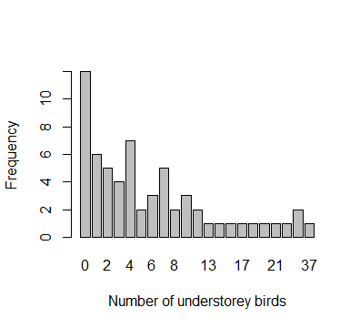
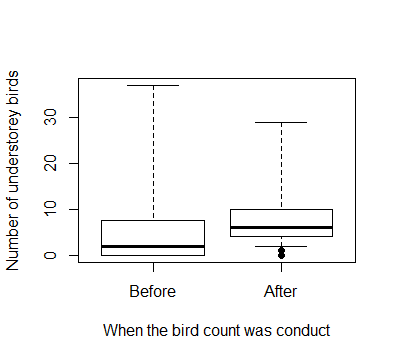
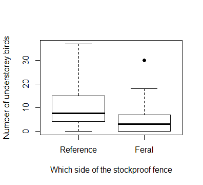
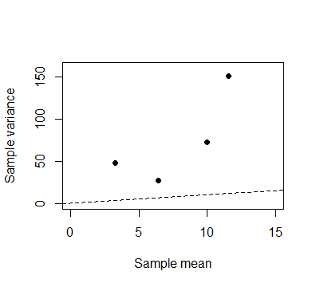
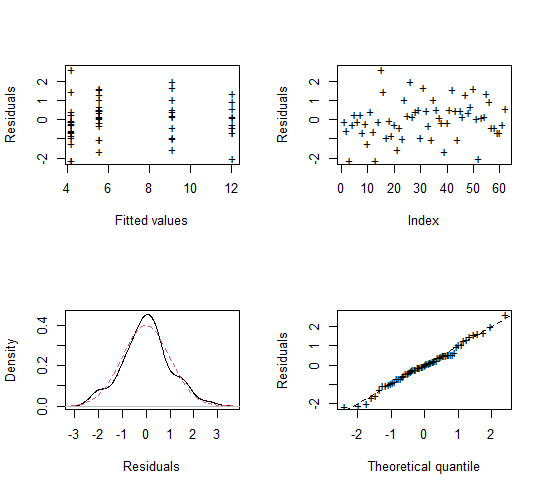
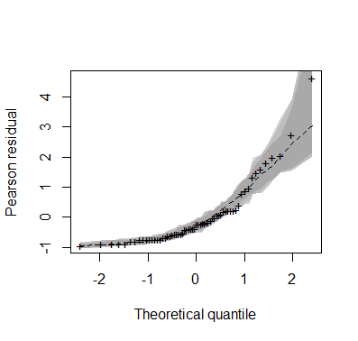
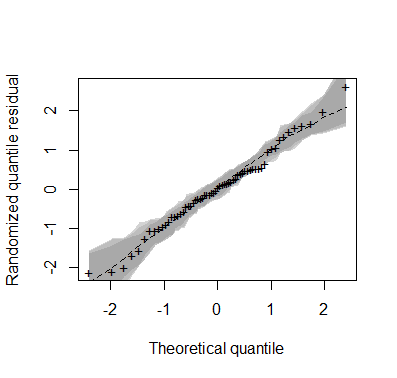
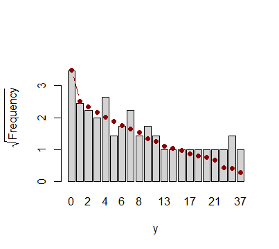

# `bergrm`: BerG Regression Model for Count Data

[](https://travis-ci.com/travis-ci/travis-web)

> Rodrigo M. R. Medeiros
> <rodrigo.matheus@live.com>, IME-USP

The `bergrm` package (in development) provide a set of functions for a complete regression analysis of count data, in which it is assumed that the dependent variable follows a BerG distribution. The BerG regression was proposed by Bourguignon and Medeiros (2020), and can be used to fit count data with overdispersion, equidispersion (but are not Poisson-distributed), and underdispersion.

## Installation

You can install the current development version of `bergrm` from [GitHub](https://github.com/rdmatheus/sdlrm) with:

``` r
devtools::install_github("rdmatheus/bergrm")
```
To run the above command, it is necessary that the `devtools` package is previously installed on R. If not, install it using the following command:

``` r
install.packages("devtools")
```
After installing the devtools package, if you are using Windows, install the most current [RTools](https://cran.r-project.org/bin/windows/Rtools/) program. Finally, run the command `devtools::install_github("rdmatheus/bergrm")`, and then the package will be installed on your computer.

## Example

This package provide complete estimation and inference for the parameters as well as simulation envelope plots, useful for assessing the goodness-of-fit of the model. The implementation is straightforward and similar to other popular packages, like `betareg` and `glm`, where the main function is `glm.bg()` (the main function was recently modified from `bergrm` to `glm.bg`). Below is an example of some functions usage and available methods.

``` r
library(bergrm)
```
There are currently two data sets available in the `bergrm` package, `grazing` and `bids`. To access the documentation associated with this data, use `help(grazing)` and `help(bids)`, respectively. In this example we use the `grazing` data set.

```r
# Data visualization (For description: ?grazing)
```





``` r
# Fit a double model (mean and dispersion) with a test for constant dispersion

fit <- glm.bg(birds ~ when + grazed | when + grazed, data = grazing, disp.test = TRUE)

## For glm.bg documentation:
?glm.bg

# Print

fit
#> 
#> Call:
#> glm.bg(formula = birds ~ when + grazed | when + grazed, data = grazing, 
#>     disp_test = TRUE)
#> 
#> mean Coefficients:
#> [1]  2.2093390  0.2780493 -0.7752226
#> 
#> dispersion Coefficients:
#> [1]  2.42884684 -0.02824461 -0.43131213

# Summary

summary(fit)
#>
#> Call:
#> glm.bg(formula = birds ~ when + grazed | when + grazed, data = grazing, 
#>        disp_test = TRUE)
#>
#> Summary for residuals:
#>        Mean       Sd  Skewness Kurtosis
#>    0.013563 0.982888  0.080752 3.057912
#> 
#> ----------------------------------------------------------------
#> Mean:
#> Coefficients:
#>             Estimate Std. Error z value  Pr(>|z|)    
#> (Intercept)  2.20934    0.31300  7.0586 1.682e-12 ***
#> whenAfter    0.27805    0.32385  0.8586   0.39058    
#> grazedFeral -0.77522    0.32582 -2.3793   0.01734 *  
#> ---
#> Signif. codes:  
#>   0 ‘***’ 0.001 ‘**’ 0.01 ‘*’ 0.05 ‘.’ 0.1 ‘ ’ 1
#> 
#> ----------------------------------------------------------------
#> Dispersion:
#> 
#> Link function: log 
#> Coefficients:
#>              Estimate Std. Error z value  Pr(>|z|)    
#> (Intercept)  2.428847   0.316975  7.6626 1.822e-14 ***
#> whenAfter   -0.028245   0.331138 -0.0853    0.9320    
#> grazedFeral -0.431312   0.339611 -1.2700    0.2041    
#> ---
#> Signif. codes:  
#>   0 ‘***’ 0.001 ‘**’ 0.01 ‘*’ 0.05 ‘.’  0.1 ‘ ’ 1
#> 
#> ----------------------------------------------------------------
#> 
#> Test for constant dispersion:
#>              S      W     LR      G
#> Value   2.5045 1.6195 1.9735 1.9987
#> P value 0.2859 0.4450 0.3728 0.3681
#> 
#> In addition, Log-lik value: -178.36 
#> AIC: 368.72 and BIC: 381.4828

# Plot

plot(fit, residual = "quantile") 
```


``` r
## Use residual = "pearson" to obtain a summary for the Pearson residuals.

# Normal probability plot with simulated envelope 

envel_berg(fit)
```



```
## Here we can also choose the residual using residual = "quantile" for
## the randomized quantile residuals; "pearson" for Pearson residuals;
## and "all" (default) for both.

# Rootogram

root_berg(fit)
```


Currently, the methods implemented for "bergrm" objects are
``` r
methods(class = "bergrm")
#>
#> [1] AIC          coef         logLik       model.matrix
#> [5] plot         print        summary      vcov        
#> see '?methods' for accessing help and source code
```
